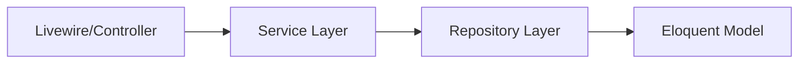
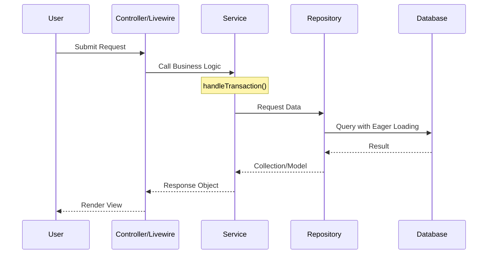

# JumpStart Furniture - Architecture Overview

This project follows a modern, enterprise-ready architecture for Laravel 9, emphasizing separation of concerns, testability, and scalability.

## Core Architectural Patterns

### 1. Service-Repository Pattern

We decouple business logic from data access to ensure the system is easy to maintain and extend.

- **Services**: Contain business logic and orchestrate data flow.
    - Location: `app/Services/`
    - Base Class: `BaseService.php` (handles transactions and retry logic)
- **Repositories**: Handle all database interactions (Eloquent).
    - Location: `app/Repositories/`
    - Base Class: `BaseRepository.php` (handles eager loading and locking)

### 2. Contract-Based Dependency Injection

Interfaces (Contracts) are used to define the "rules" for services and repositories, allowing for easy mocking and implementation swaps.

- **Contracts**: Located in `app/Contracts/`.
- **Implementation**: Bound in `AppServiceProvider` or `RepositoryServiceProvider`.

## System Flow

The typical request flow ensures data integrity via database transactions and consistent error handling:

## Key Infrastructure Features

- **Pessimistic Locking**: Used in critical paths (e.g., checkout) via `lockForUpdate()` in repositories.
- **Idempotency**: Implemented for payments/checkout to prevent duplicate processing.
- **RBAC (Role Based Access Control)**: Managed through Laravel Policies in `app/Policies/`.
- **Atomic UI**: A comprehensive Design System using the `x-ui` component library.
