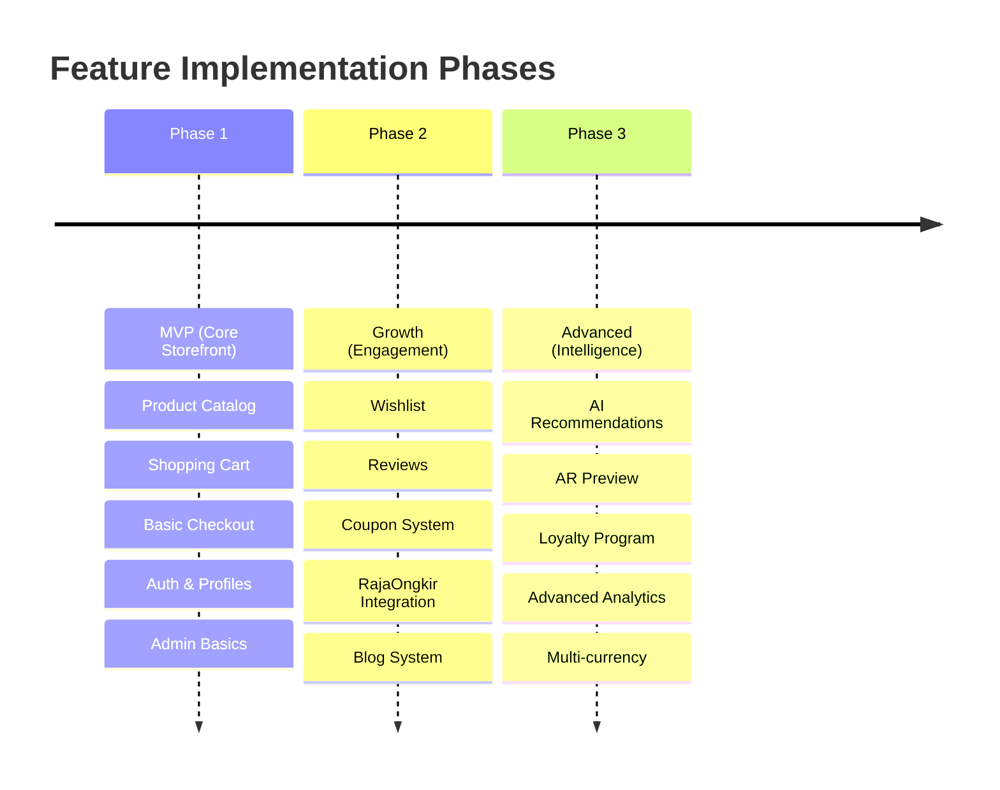

# JumpStart Furniture - Feature Roadmap & Implementation Guide

This document outlines the strategic roadmap for implementing the JumpStart Furniture e-commerce platform. It balances business goals with technical excellence, ensuring a scalable and professional storefront.

## 🎯 Project Vision

To build an enterprise-grade furniture e-commerce platform that combines high-end visual storytelling with robust logistics and secure financial processing.

---

## 🛤️ Implementation Roadmap

---

## 🛠️ Phase 1: MVP (Minimum Viable Product)

**Focus**: Establishing the core buying loop and management foundation.

### 1.1 Storefront Discovery

- [ ] **Advanced Hero Section**: Responsive carousel with Lifestyle shots.
- [ ] **Dynamic Product Catalog**:
    - [ ] Real-time filtering (Livewire) for Color, Material, and Room Type.
    - [ ] Responsive grid (2 cols mobile, 4-5 cols desktop).
- [ ] **Enhanced Product Detail**:
    - [ ] Variation Selector (Swatches for color/material).
    - [ ] Technical Specifications table.

### 1.2 Cart & Checkout (Xendit Integration)

- [ ] **Livewire Mini-Cart**: Sidebar for quick updates.
- [ ] **Multi-Step Checkout**:
    - [ ] **Step 1**: Shipping info with automatic address validation.
    - [ ] **Step 2**: Payment via Xendit (Virtual Account, E-Wallet, QRIS).
    - [ ] **Idempotency**: Prevent double payments via cache-locked keys.

### 1.3 Admin Core

- [ ] **Dashbord Metrics**: Total Sales, New Orders, and Conversion Rate widgets.
- [ ] **Product Variation Management**: Parent-Child SKU structure for colors/sizes.
- [ ] **Order Pipeline**: Status transitions (Pending -> Paid -> Packing -> Shipped).

---

## 📈 Phase 2: Growth & Optimization

**Focus**: Enhancing user trust and automating operations.

### 2.1 Logistics & Shipping

- [ ] **RajaOngkir Starter Integration**: Dynamic shipping rates for JNE/SiCepat.
- [ ] **Volume/Weight Logic**: Automatic calculation of (P×L×T)/6000 vs. actual weight.
- [ ] **WA Notifications**: Automated status updates via Fonnte/Wablas.

### 2.2 User Trust

- [ ] **Verified Reviews**: Star ratings with photo uploads from actual buyers.
- [ ] **Wishlist Analytics**: Track "most saved" items for admin insights.
- [ ] **Coupon Engine**: Percentage vs. Fixed Amount discounts with usage limits.

---

## 💎 Phase 3: Advanced Intelligence

**Focus**: Personalization and "Shop the Look" features.

- [ ] **Blog Integration**: "Shop the Look" tags inside interior design tips.
- [ ] **Inventory Intelligence**: Low stock threshold alerts and automatic Pre-Order status shifts.
- [ ] **Financial Exports**: One-click Excel reports for tax and inventory auditing.

---

## 📜 Technical Standards

### 1. Coding Best Practices

- **Service-Repository Pattern**: All business logic stays in `app/Services/`.
- **Validation**: Use `FormRequests` with `prepareForValidation` for sanitizing user input.
- **Strict Typing**: Use PHP 8.1+ type hinting for all method signatures.

### 2. Performance Optimization

- **Image Handling**: Use **Intervention Image** for WebP conversion.
- **Eager Loading**: Prevent N+1 queries by defining `with()` in the `BaseRepository`.
- **Cache Strategy**: Store high-traffic queries (Category list, Best Sellers) in Redis.

### 3. Security Checklist

- [ ] **CSRF & XSS**: Standard Laravel protection + HTML Purifier for blog content.
- [ ] **RBAC**: Strict Policies for `admin` vs `customer` access.
- [ ] **Data Encryption**: Encrypt PII (Personally Identifiable Information) in the DB.

---

## 📊 Success Metrics (KPIs)

| Metric              | Target                     |
| :------------------ | :------------------------- |
| **Page Load Time**  | < 2.5 seconds              |
| **Mobile UX Score** | > 90 (Lighthouse)          |
| **Conversion Rate** | > 2.0%                     |
| **Cart Recovery**   | > 15% via automated emails |

---

_Created on: February 8, 2026 | Version: 1.0.0_
