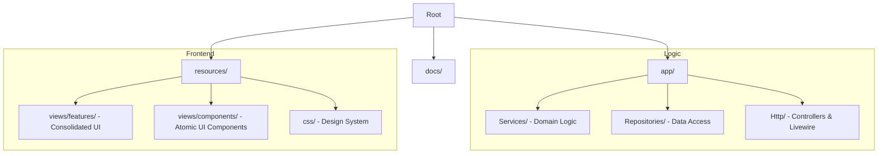

# JumpStart Furniture - Folder Structure Guide

We have consolidated the project into a feature-based structure to improve discoverability and maintain a clean separation of domain logic.

## High-Level Overview

## 1. Feature-Based View Organization

Instead of standard Laravel flat folders, we group views by their functional domain in `resources/views/features/`.

| Feature Folder | Description                                               |
| :------------- | :-------------------------------------------------------- |
| `admin/`       | Management dashboards (Product, Blog, User).              |
| `shop/`        | Public storefront pages (Landing, Product Details, Cart). |
| `payment/`     | Checkout and payment processing views.                    |
| `auth/`        | Consolidated Login, Register, and Forgot Password views.  |
| `profile/`     | User settings and security management.                    |
| `content/`     | Static pages like About, Term, and Policy.                |

## 2. Advanced Component Library (`x-ui`)

We utilize an atomic design system located in `resources/views/components/ui/`.

- **Atomic Components**: `badge`, `button`, `card`, `input`, `modal`.
- **Naming Pattern**: `<x-ui.[component-name]>`
- **Responsive-First**: All components are built with Tailwind CSS 3+ for perfect mobile responsiveness.

## 3. Configuration & Routing

- **`routes/web.php`**: All routes are named and point to consolidated feature views.
- **`JetstreamServiceProvider`**: Overrides default Jetstream/Fortify view locations to point to the `features/` directory.

## 4. Documentation

- `docs/ARCHITECTURE.md`: Technical patterns and flow.
- `docs/FOLDER_STRUCTURE.md`: This file.
